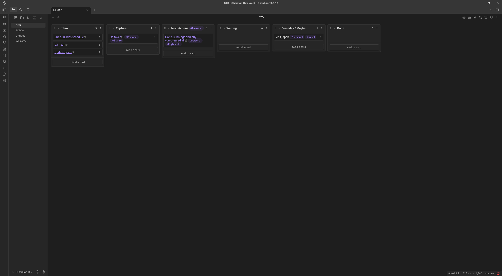

# Obsidian Syncer

Sync external data sources into your Obsidian vault.

This plugin fetches data from external sources and syncs them to a target Markdown document under a configurable heading. The first supported source is Google Tasks, with more integrations planned. Inspired by [_Getting Things Done_ (GTD)](https://en.wikipedia.org/wiki/Getting_Things_Done), it's equally suited to any workflow based on to-do lists or Kanban boards. Designed to integrate well with the [Obsidian Kanban plugin](https://github.com/mgmeyers/obsidian-kanban) and the [Obsidian Tasks plugin](https://github.com/obsidian-tasks-group/obsidian-tasks).

[](screenshots/gtd-kanban-example.png)

## Features

- Scheduled background sync on a configurable interval (minutes)
- Manual sync command from the Command Palette
- Configurable target Markdown file to write to
- Configurable target heading under which items will be inserted
- Google Tasks integration:
  - OAuth 2.0 (Authorization Code with PKCE)
  - Select which task lists to sync
  - Only incomplete Google Tasks are synced into Obsidian; when you complete a task in Google it drops out of the incoming feed and the corresponding line is removed from the items under the target heading in the Obsidian note on the next sync
  - Bidirectional completion status sync for active tasks: checking/unchecking tasks in Obsidian syncs completion status back to Google Tasks

## Requirements

- Node.js >= 22.15 (for builds and tests)
- Obsidian Desktop
- (Optional) [Obsidian Kanban plugin](https://github.com/mgmeyers/obsidian-kanban) for task board views
- (Optional) [Obsidian Tasks plugin](https://github.com/obsidian-tasks-group/obsidian-tasks) for enhanced task management

## Installation

Manual install into a vault:

1. Build the plugin (see [Development](##-development) below)
1. Copy these files to your vault: `Vault/.obsidian/plugins/obsidian-syncer/`
   - `manifest.json`
   - `main.js`
   - `styles.css`
1. Enable “Obsidian Syncer” in Obsidian → Settings → Community plugins

## Configuration

Open Obsidian settings and navigate to **Community plugins** → **Obsidian Syncer**.

GTD tip: The plugin ships with sensible defaults for a GTD-style setup—`GTD.md` as the target file and `## Inbox` as the heading. You can keep these for a classic capture inbox, or change them to suit your workflow.

### Google Tasks:

- Connect your Google account using the **Connect** button in the plugin's settings tab
- Select task lists to sync via the multi-select input

## Commands:

- `Manual Sync`: Triggers a once-off sync and restarts the scheduler

## Development

Install dependencies, then build with esbuild.

```sh
npm clean-install
```

```sh
npm run build:dev
```

Sync to your vault with:

```sh
npm run sync
```

You will need to create a dev Obsidian vault and set the `OBSIDIAN_VAULT_PLUGIN_DIR_DEV` variable in a [`.envrc`](https://direnv.net/) file to use the `sync` script. See `envrc.example` for an example.

It is also recommended to install the [Hot-Reload plugin](https://github.com/pjeby/hot-reload) for automatic reloads.

## Releasing

1. Update version: `npm run version` (or `npm version patch|minor|major`)
2. Build production: `GOOGLE_CLIENT_ID_PROD=your-id npm run build:prod`
3. Verify: `npm run release:check`
4. Create release:
   - **Automated**: `git tag v1.0.0 && git push origin v1.0.0` (triggers release workflow)
   - **Manual**: Create GitHub release with `main.js`, `manifest.json`, `styles.css`
5. Submit to [Obsidian Community Plugins](https://github.com/obsidianmd/obsidian-releases)
