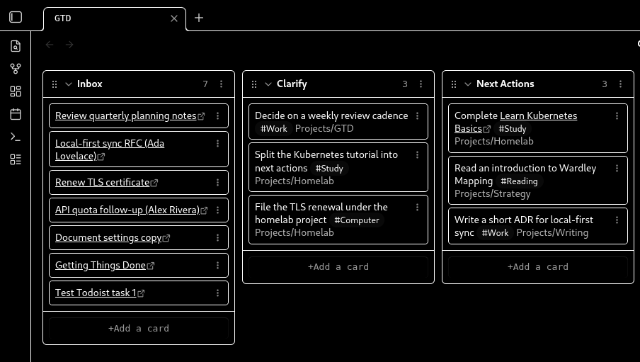
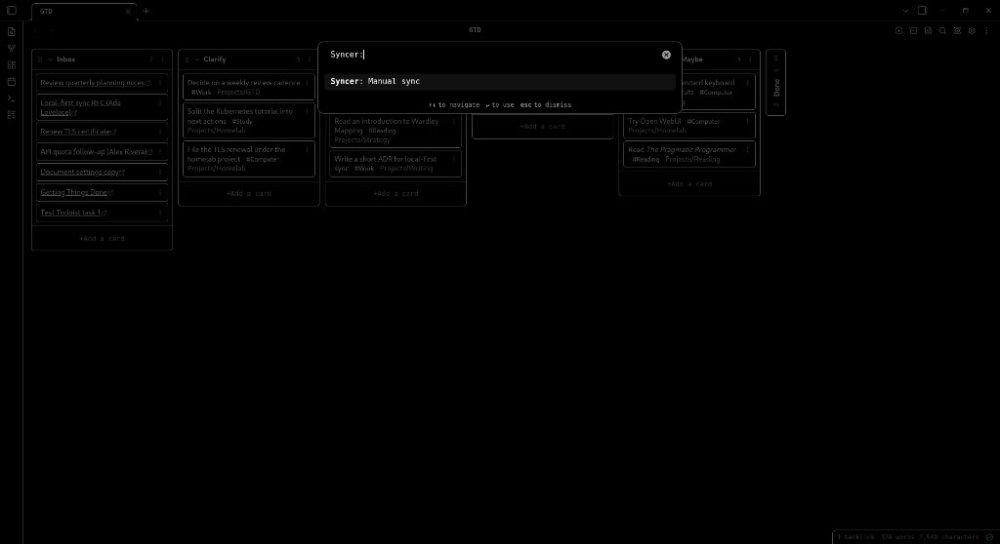
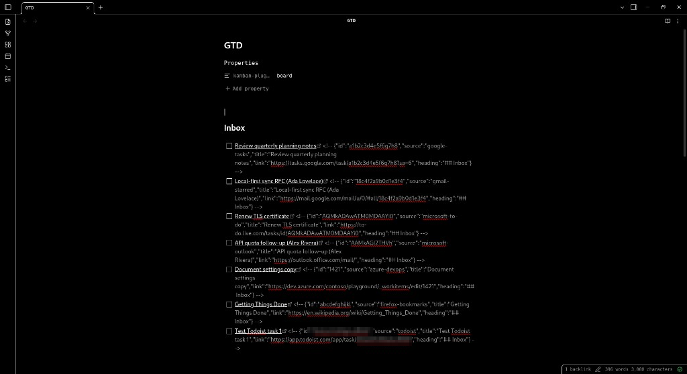
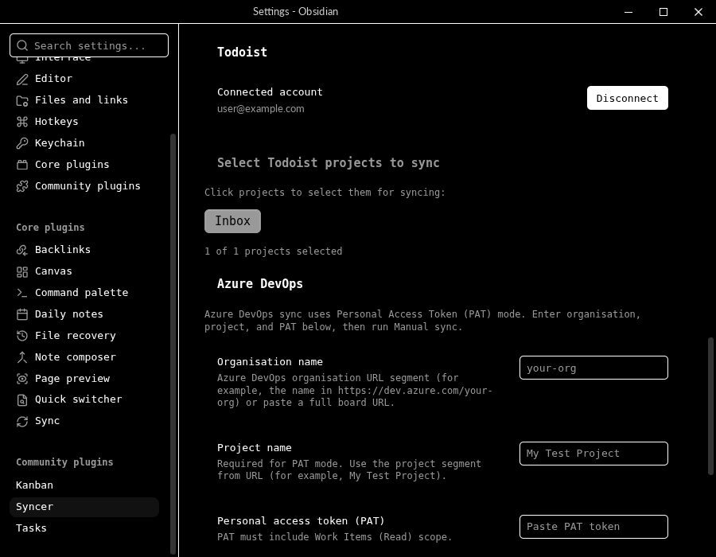
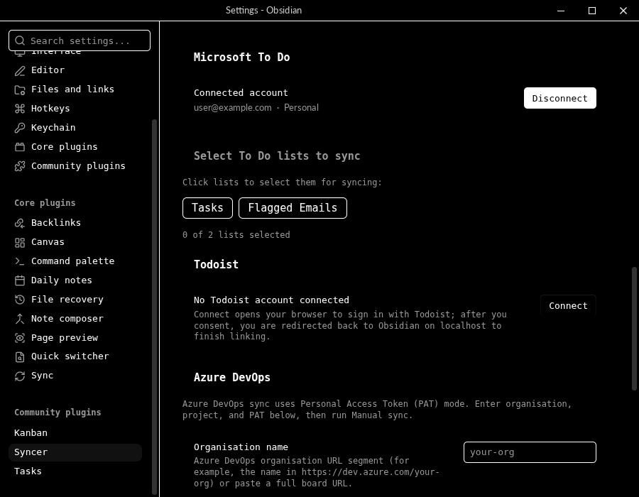

# Syncer

Obsidian plugin to sync references/links to Google Tasks, Gmail Starred, Microsoft To Do, Microsoft Outlook, Azure DevOps, Firefox Bookmarks, and Todoist into your vault.

Site: [obsidiansyncer.com](https://obsidiansyncer.com) · [Privacy Policy](https://obsidiansyncer.com/privacy.html) · [Terms of Service](https://obsidiansyncer.com/terms.html)

This plugin fetches data from external sources and syncs references/links to them into a target Markdown document under a configurable heading. Supported sources are Google Tasks, Gmail Starred, Microsoft To Do, Microsoft Outlook (flagged mail), Azure DevOps (assigned work items), Firefox Bookmarks (desktop), and Todoist. Inspired by [_Getting Things Done_ (GTD)](https://en.wikipedia.org/wiki/Getting_Things_Done), but equally suited to any workflow based on to-do lists or Kanban boards. Designed to integrate well with the [Obsidian Kanban plugin](https://github.com/mgmeyers/obsidian-kanban) and the [Obsidian Tasks plugin](https://github.com/obsidian-tasks-group/obsidian-tasks).

[](screenshots/gtd-kanban-closeup.png)










## Features

- Scheduled background sync on a configurable interval (minutes)
- Manual sync command from the Command Palette
- Configurable target Markdown file to write to
- Configurable target heading under which items will be inserted
- Optional sync of completion status from Obsidian back to connected sources (off by default)
- Google Tasks integration:
  - OAuth 2.0 (Authorization Code)
  - Select which task lists to sync
  - Only incomplete Google Tasks are synced into Obsidian; when you complete a task in Google it drops out of the incoming feed and the corresponding line is removed from the items under the target heading in the Obsidian note on the next sync
  - Optional deletion sync (off by default): deleting a synced Google task in Obsidian can also delete it in Google Tasks (with optional confirmation)
- Gmail Starred integration:
  - OAuth 2.0 (Authorization Code)
  - Syncs starred Gmail messages into Obsidian
  - Configurable maximum number of starred messages to sync per run
  - When completion status sync is enabled, checking/unchecking synced items in Obsidian updates the Gmail star state on the next sync
- Microsoft Outlook integration:
  - OAuth 2.0 (Authorization Code with PKCE) via Microsoft identity platform
  - Syncs messages with an Outlook follow-up flag set to flagged
  - Personal (Outlook.com / Hotmail / Live) or work/school accounts (optional Entra tenant ID)
  - When completion status sync is enabled, checking/unchecking items in Obsidian updates the Outlook flag on the next sync
- Microsoft To Do integration:
  - Separate OAuth consent from Outlook (Tasks scopes on the same Entra app — add delegated **Tasks.ReadWrite**)
  - Select which To Do lists to sync
  - Incomplete tasks only; completing in To Do removes the Obsidian line (checkbox is not auto-checked)
  - When completion status sync is enabled, checking/unchecking in Obsidian updates task status in To Do on the next sync
- Todoist integration:
  - OAuth 2.0 (Authorization Code with PKCE) via a Todoist public client (Dynamic Client Registration)
  - Select which projects to sync
  - Incomplete tasks only; completing in Todoist removes the Obsidian line (checkbox is not auto-checked)
  - When completion status sync is enabled, checking/unchecking in Obsidian closes/reopens tasks in Todoist on the next sync
  - Requires a maintainer Todoist app; production builds use the committed client ID in `oauth-clients.prod.json`
- Azure DevOps integration:
  - Personal Access Token (PAT) authentication
  - One organisation + one project per settings profile
  - Syncs work items assigned to the connected user with clickable links to the work item in the browser
  - One-way sync only; checking items in Obsidian does not update work item state in Azure DevOps
- Firefox Bookmarks integration (desktop only):
  - Sync bookmarks from a local Firefox profile into your vault
  - Auto-detect default profile or set a manual profile path
  - Search and select bookmark folders (subfolders included recursively)
  - One-way sync: Firefox → Obsidian only; checking items in Obsidian does not change Firefox
  - Works while Firefox is open when `sqlite3` or Python is available to merge the places WAL; otherwise close Firefox briefly and sync again

## Requirements

- Node.js >= 22.15 (for builds and tests)
- Obsidian Desktop
- (Optional) [Obsidian Kanban plugin](https://github.com/mgmeyers/obsidian-kanban) for task board views
- (Optional) [Obsidian Tasks plugin](https://github.com/obsidian-tasks-group/obsidian-tasks) for enhanced task management

## Installation

Install **Syncer** from Obsidian’s Community plugins browser, or from the [Community directory](https://community.obsidian.md/plugins/syncer).

### From source

1. Build the plugin (see [Development](#development) below)
1. Copy these files to your vault: `Vault/.obsidian/plugins/syncer/`
   - `manifest.json`
   - `main.js`
   - `styles.css`
1. Enable **Syncer** in Obsidian → Settings → Community plugins

## Configuration

Open Obsidian settings and navigate to **Community plugins** → **Syncer**.

GTD tip: The plugin ships with sensible defaults for a GTD-style setup—`GTD.md` as the target file and `## Inbox` as the heading. You can keep these for a classic capture inbox, or change them to suit your workflow.

### General

- **Sync interval (minutes)**: How often background sync runs
- **Sync markdown file path**: Target note for synced items (sync saves the note if needed, then reads the on-disk file)
- **Sync heading**: H2 heading under which new items are inserted (input is normalised to `## …`)
- **Sync completion status**: When enabled, completing or uncompleting synced items in Obsidian updates Google Tasks, Gmail stars, Microsoft To Do, Microsoft Outlook (email flags), and Todoist on the next sync. With Kanban boards that move cards to a Done column, enable this if you want local `[x]` to write back before Syncer reconciles against the incomplete remote feed (otherwise a still-open remote task can uncheck the card in place).

### Google Tasks

- Connect your Google account using the **Connect** button in the plugin's settings tab
- Select task lists to sync via the multi-select input
- **Sync task deletions** is off by default; enable it (and optional confirmation) if you want deleting a Google Tasks item in Obsidian to also delete it in Google Tasks

### Gmail Starred

- Connect your Google account using the **Connect** button in the plugin's settings tab
- Set **Gmail Starred max items** to control how many starred messages are synced each run
- Starred messages are synced into the target note under the sync heading

### Microsoft Outlook

- Choose **Outlook account type** (personal or work/school); for work/school you may optionally set a Directory (tenant) ID
- Connect your Microsoft account using the **Connect** button (requires the plugin to be built with a Microsoft application client ID)
- Flagged messages are synced into the target note under the sync heading
- Connect / disconnect Outlook independently of Microsoft To Do

### Microsoft To Do

- Connect after adding **Tasks.ReadWrite** (delegated) to your existing Syncer Entra app (same client ID as Outlook)
- Select one or more To Do lists to sync; account type / tenant fields above apply to the next Connect only
- Incomplete tasks from selected lists sync under the sync heading
- Disconnect clears To Do credentials only — Outlook and existing note lines are unaffected

### Todoist

- Connect using **Connect** (production builds include the committed Todoist client ID; local `build:dev` needs `TODOIST_CLIENT_ID_DEV`)
- Select one or more projects to sync
- Incomplete tasks from selected projects sync under the sync heading
- Disconnect clears Todoist credentials; existing Todoist lines remain in your sync note until you remove them or deselect their projects

#### OAuth app setup (maintainers)

1. Register a **public client** with `POST https://api.todoist.com/oauth/register` (`token_endpoint_auth_method: none`, scope `data:read_write`, grant types `authorization_code` + `refresh_token`). The [App Management Console](https://developer.todoist.com/appconsole.html) only creates confidential clients, which require a `client_secret` Syncer cannot ship.
2. Use redirect URIs: `http://localhost:27855/`, `http://localhost:27856/`, `http://localhost:27857/`
3. Put the **production** `tdd_…` client ID in `oauth-clients.prod.json` (and allow the key in `scripts/check-oauth-clients.mjs`). Use `TODOIST_CLIENT_ID_DEV` in `.env` for local `build:dev` only.

### Azure DevOps

- Enter your **Organisation name** (the URL segment from `https://dev.azure.com/your-org`, or paste the full URL and Syncer will extract the name)
- Enter **Project name**
- Enter **Personal access token (PAT)** with **Work Items (Read)** scope
- Run **Manual sync** — Syncer fetches work items assigned to your account in the configured project

#### PAT setup (Azure DevOps)

1. Open Azure DevOps user settings → **Personal access tokens**
2. Create a token with scope **Work Items (Read)** (optionally **Project and Team (Read)**)
3. Copy the token and paste it into Syncer’s **Personal access token (PAT)** field

### Firefox Bookmarks (desktop only)

- Enable **Firefox Bookmarks** in the plugin settings
- Optionally set a **Firefox profile path**; leave empty to auto-detect the default profile from `profiles.ini`
- Click **Refresh folders**, then search by folder name and select parents to include (subfolders are synced recursively — nested matches under a hit are hidden in search)
- Typical profile locations:
  - Linux: `~/.mozilla/firefox/<profile>/`
  - macOS: `~/Library/Application Support/Firefox/Profiles/<profile>/`
  - Windows: `%APPDATA%\Mozilla\Firefox\Profiles\<profile>\`
- If newest bookmarks are missing while Firefox is open, close Firefox briefly and sync again (or install the `sqlite3` CLI so the plugin can merge the live database)

## Commands

- `Manual sync`: Triggers a once-off sync and restarts the scheduler

## Development

Contributor/agent notes for architecture and sync rules live in [docs/kb/](docs/kb/).

Install dependencies, then build with esbuild.

```sh
npm clean-install
```

```sh
npm run build:dev
```

Set `GOOGLE_CLIENT_ID_DEV`, `MICROSOFT_CLIENT_ID_DEV`, and `TODOIST_CLIENT_ID_DEV` (see `.env.example`) to enable Connect in development builds. If omitted, the build still succeeds but the matching Connect actions are disabled.

Sync to your vault with:

```sh
npm run sync
```

You will need to create a dev Obsidian vault and set the `OBSIDIAN_VAULT_PLUGIN_DIR_DEV` variable in a [`.envrc`](https://direnv.net/) file to use the `sync` script. See [`.envrc.example`](.envrc.example) for an example.

It is also recommended to install the [Hot-Reload plugin](https://github.com/pjeby/hot-reload) for automatic reloads.

## Privacy and disclosures

This section is for [Obsidian developer policy](https://docs.obsidian.md/Community+directory/Developer+policies) review and for users who want to know what the plugin contacts before installing.

Hosted copies used for Google OAuth verification: [homepage](https://obsidiansyncer.com/), [Privacy Policy](https://obsidiansyncer.com/privacy.html), and [Terms of Service](https://obsidiansyncer.com/terms.html).

Syncer is a local plugin: it does not run a Syncer backend, proxy, or hosted API. Data access is limited to the integrations you enable:

- **Account requirement**: cloud sync features need a corresponding Google account (Tasks / Gmail), Microsoft account (Outlook / To Do), Todoist account, and/or Azure DevOps account. Firefox Bookmarks sync is local and does not require a cloud account.
- **Credentials / API keys**: Google, Microsoft, and Todoist use OAuth 2.0 (tokens stored in plugin settings). Azure DevOps uses a Personal Access Token (PAT) you paste in settings. OAuth tokens and PATs are sent only to the matching provider endpoints below — never to a Syncer service.
- **Network use**: when an integration is connected and sync runs, Syncer calls that provider to read/update items. Typical hosts include:
  - Google: `accounts.google.com`, `oauth2.googleapis.com`, `www.googleapis.com`, `tasks.googleapis.com`, `gmail.googleapis.com`
  - Microsoft: `login.microsoftonline.com`, `graph.microsoft.com`
  - Todoist: `app.todoist.com`, `api.todoist.com`
  - Azure DevOps: `dev.azure.com`

> [!WARNING]
> **Outside-vault filesystem access (Firefox Bookmarks).** On Obsidian desktop, enabling Firefox Bookmarks sync reads Firefox profile files outside your vault (for example `places.sqlite` and WAL sidecars) via the local filesystem, scoped to the selected or auto-detected profile and temporary hot-copy files. Syncer does not write back to the live Firefox database. See [SECURITY.md](SECURITY.md) for details.

- **Telemetry / ads**: Syncer does not include client-side telemetry, analytics SDKs, or ads.

## Attribution

No third-party UI components are currently bundled in the settings tab.

## Releasing

1. Bump version with **`npm version patch|minor|major`** (or `npm version x.y.z`). This updates `package.json` / `manifest.json` / `versions.json`, commits, and creates an **annotated** git tag (required). Do not use `git tag x.y.z` without `-a` — `git push --follow-tags` only pushes annotated tags.
2. Build production: `npm run build` (uses committed public OAuth client IDs in `oauth-clients.prod.json`; local env vars may override for development)
3. Verify: `npm run release:check` (fails if the version tag exists but is lightweight)
4. Confirm the tag is annotated: `git cat-file -t x.y.z` must print `tag` (not `commit`). If you ever need a manual tag: `git tag -a x.y.z -m "x.y.z"`.
5. Push commit and tag: `git push --follow-tags` (triggers release workflow; tags must match `[0-9]*`, e.g. `0.2.1`, not `v0.2.1`). If `--follow-tags` skips the tag, push it explicitly: `git push origin x.y.z`.
6. Verify the GitHub release contains `main.js`, `manifest.json`, `styles.css`, and the generated attestation bundle
7. Submit the new plugin version through [Obsidian Community directory](https://community.obsidian.md), following [Submit your plugin](https://docs.obsidian.md/plugins/releasing/submit-plugin), then monitor automated review results
