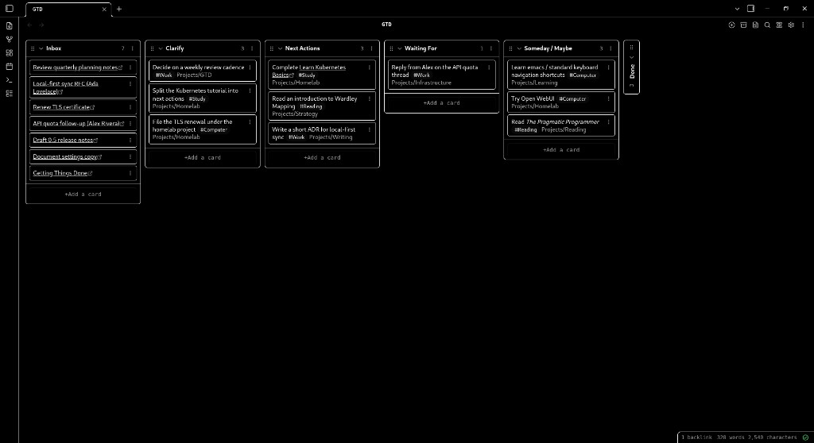

# Syncer

Obsidian plugin to sync external sources like Google Tasks, Gmail Starred, Microsoft Outlook, Azure DevOps, and Firefox Bookmarks into your vault.

This plugin fetches data from external sources and syncs them to a target Markdown document under a configurable heading. Supported sources are Google Tasks, Gmail Starred, Microsoft Outlook (flagged mail), Azure DevOps (assigned work items), and Firefox Bookmarks (desktop). Inspired by [_Getting Things Done_ (GTD)](https://en.wikipedia.org/wiki/Getting_Things_Done), but equally suited to any workflow based on to-do lists or Kanban boards. Designed to integrate well with the [Obsidian Kanban plugin](https://github.com/mgmeyers/obsidian-kanban) and the [Obsidian Tasks plugin](https://github.com/obsidian-tasks-group/obsidian-tasks).

[](screenshots/gtd-kanban-example.png)

## Features

- Scheduled background sync on a configurable interval (minutes)
- Manual sync command from the Command Palette
- Configurable target Markdown file to write to
- Configurable target heading under which items will be inserted
- Optional sync of completion status from Obsidian back to connected sources (off by default)
- Google Tasks integration:
  - OAuth 2.0 (Authorization Code)
  - Select which task lists to sync
  - Only incomplete Google Tasks are synced into Obsidian; when you complete a task in Google it drops out of the incoming feed and the corresponding line is removed from the items under the target heading in the Obsidian note on the next sync
  - Optional deletion sync (off by default): deleting a synced Google task in Obsidian can also delete it in Google Tasks (with optional confirmation)
- Gmail Starred integration:
  - OAuth 2.0 (Authorization Code)
  - Syncs starred Gmail messages into Obsidian
  - Configurable maximum number of starred messages to sync per run
  - When completion status sync is enabled, checking/unchecking synced items in Obsidian updates the Gmail star state on the next sync
- Microsoft Outlook integration:
  - OAuth 2.0 (Authorization Code with PKCE) via Microsoft identity platform
  - Syncs messages with an Outlook follow-up flag set to flagged
  - Personal (Outlook.com / Hotmail / Live) or work/school accounts (optional Entra tenant ID)
  - When completion status sync is enabled, checking/unchecking items in Obsidian updates the Outlook flag on the next sync
- Azure DevOps integration:
  - Personal Access Token (PAT) authentication
  - One organisation + one project per settings profile
  - Syncs work items assigned to the connected user with clickable links to the work item in the browser
  - One-way sync only; checking items in Obsidian does not update work item state in Azure DevOps
- Firefox Bookmarks integration (desktop only):
  - Sync bookmarks from a local Firefox profile into your vault
  - Auto-detect default profile or set a manual profile path
  - Search and select bookmark folders (subfolders included recursively)
  - One-way sync: Firefox → Obsidian only; checking items in Obsidian does not change Firefox
  - Works while Firefox is open when `sqlite3` or Python is available to merge the places WAL; otherwise close Firefox briefly and sync again

## Requirements

- Node.js >= 22.15 (for builds and tests)
- Obsidian Desktop
- (Optional) [Obsidian Kanban plugin](https://github.com/mgmeyers/obsidian-kanban) for task board views
- (Optional) [Obsidian Tasks plugin](https://github.com/obsidian-tasks-group/obsidian-tasks) for enhanced task management

## Installation

Manual install into a vault:

1. Build the plugin (see [Development](#development) below)
1. Copy these files to your vault: `Vault/.obsidian/plugins/syncer/`
   - `manifest.json`
   - `main.js`
   - `styles.css`
1. Enable “Syncer” in Obsidian → Settings → Community plugins

## Configuration

Open Obsidian settings and navigate to **Community plugins** → **Syncer**.

GTD tip: The plugin ships with sensible defaults for a GTD-style setup—`GTD.md` as the target file and `## Inbox` as the heading. You can keep these for a classic capture inbox, or change them to suit your workflow.

### General

- **Sync interval (minutes)**: How often background sync runs
- **Sync markdown file path**: Target note for synced items (sync reads the saved file on disk—save changes before running Manual sync)
- **Sync heading**: H2 heading under which new items are inserted (input is normalised to `## …`)
- **Sync completion status**: When enabled, completing or uncompleting synced items in Obsidian updates Google Tasks, Gmail stars, and Microsoft Outlook (email flags) on the next sync

### Google Tasks

- Connect your Google account using the **Connect** button in the plugin's settings tab
- Select task lists to sync via the multi-select input
- **Sync task deletions** is off by default; enable it (and optional confirmation) if you want deleting a Google Tasks item in Obsidian to also delete it in Google Tasks

### Gmail Starred

- Connect your Google account using the **Connect** button in the plugin's settings tab
- Set **Gmail Starred max items** to control how many starred messages are synced each run
- Starred messages are synced into the target note under the sync heading

### Microsoft Outlook

- Choose **Outlook account type** (personal or work/school); for work/school you may optionally set a Directory (tenant) ID
- Connect your Microsoft account using the **Connect** button (requires the plugin to be built with a Microsoft application client ID)
- Flagged messages are synced into the target note under the sync heading

### Azure DevOps

- Enter your **Organisation name** (the URL segment from `https://dev.azure.com/your-org`, or paste the full URL and Syncer will extract the name)
- Enter **Project name**
- Enter **Personal access token (PAT)** with **Work Items (Read)** scope
- Run **Manual sync** — Syncer fetches work items assigned to your account in the configured project

#### PAT setup (Azure DevOps)

1. Open Azure DevOps user settings → **Personal access tokens**
2. Create a token with scope **Work Items (Read)** (optionally **Project and Team (Read)**)
3. Copy the token and paste it into Syncer’s **Personal access token (PAT)** field

### Firefox Bookmarks (desktop only)

- Enable **Firefox Bookmarks** in the plugin settings
- Optionally set a **Firefox profile path**; leave empty to auto-detect the default profile from `profiles.ini`
- Click **Refresh folders**, then search by folder name and select parents to include (subfolders are synced recursively — nested matches under a hit are hidden in search)
- Typical profile locations:
  - Linux: `~/.mozilla/firefox/<profile>/`
  - macOS: `~/Library/Application Support/Firefox/Profiles/<profile>/`
  - Windows: `%APPDATA%\Mozilla\Firefox\Profiles\<profile>\`
- If newest bookmarks are missing while Firefox is open, close Firefox briefly and sync again (or install the `sqlite3` CLI so the plugin can merge the live database)

## Commands

- `Manual sync`: Triggers a once-off sync and restarts the scheduler

## Development

Contributor/agent notes for architecture and sync rules live in [docs/kb/](docs/kb/).

Install dependencies, then build with esbuild.

```sh
npm clean-install
```

```sh
npm run build:dev
```

Set `GOOGLE_CLIENT_ID_DEV` and `MICROSOFT_CLIENT_ID_DEV` (see `.env.example`) to enable Google/Microsoft Connect in development builds. If omitted, the build still succeeds but Connect actions are disabled.

Sync to your vault with:

```sh
npm run sync
```

You will need to create a dev Obsidian vault and set the `OBSIDIAN_VAULT_PLUGIN_DIR_DEV` variable in a [`.envrc`](https://direnv.net/) file to use the `sync` script. See [`.envrc.example`](.envrc.example) for an example.

It is also recommended to install the [Hot-Reload plugin](https://github.com/pjeby/hot-reload) for automatic reloads.

## Privacy and disclosures

Syncer is a local plugin and does not run a Syncer backend service. Data access is limited to the integrations you configure:

- **Network use**: Syncer calls Google Tasks APIs, Gmail APIs, Microsoft Graph APIs, and Azure DevOps APIs to read/update items for your connected accounts.
- **Account requirement**: external sync features require a corresponding Google, Microsoft, and/or Azure DevOps account.
- **Outside-vault file access**: Firefox Bookmarks sync reads Firefox profile files (for example `places.sqlite`) outside your Obsidian vault to import selected bookmarks.
- **Telemetry/ads**: Syncer does not include client-side telemetry or ad SDKs.

## Attribution

This plugin includes code adapted from the following projects:

- **Periodic Notes** ([liamcain/obsidian-periodic-notes](https://github.com/liamcain/obsidian-periodic-notes)) - The `Suggest` and `FileSuggest` components used in the settings tab are based on code from this plugin.

## Releasing

1. Update version: `npm run version` (or `npm version patch|minor|major`)
2. Build production: `GOOGLE_CLIENT_ID_PROD=your-id MICROSOFT_CLIENT_ID_PROD=your-id npm run build:prod` (Google and Microsoft client IDs required)
3. Verify: `npm run release:check`
4. Push commit and tag: `git push --follow-tags` (triggers release workflow; tags must match `[0-9]*`, e.g. `0.2.1`, not `v0.2.1`)
5. Verify the GitHub release contains `main.js`, `manifest.json`, `styles.css`, and the generated attestation bundle
6. Submit the new plugin version through [Obsidian Community directory](https://community.obsidian.md), following [Submit your plugin](https://docs.obsidian.md/plugins/releasing/submit-plugin), then monitor automated review results
