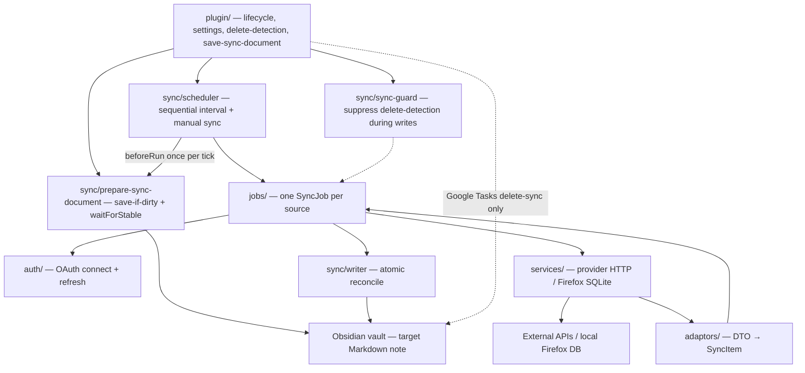
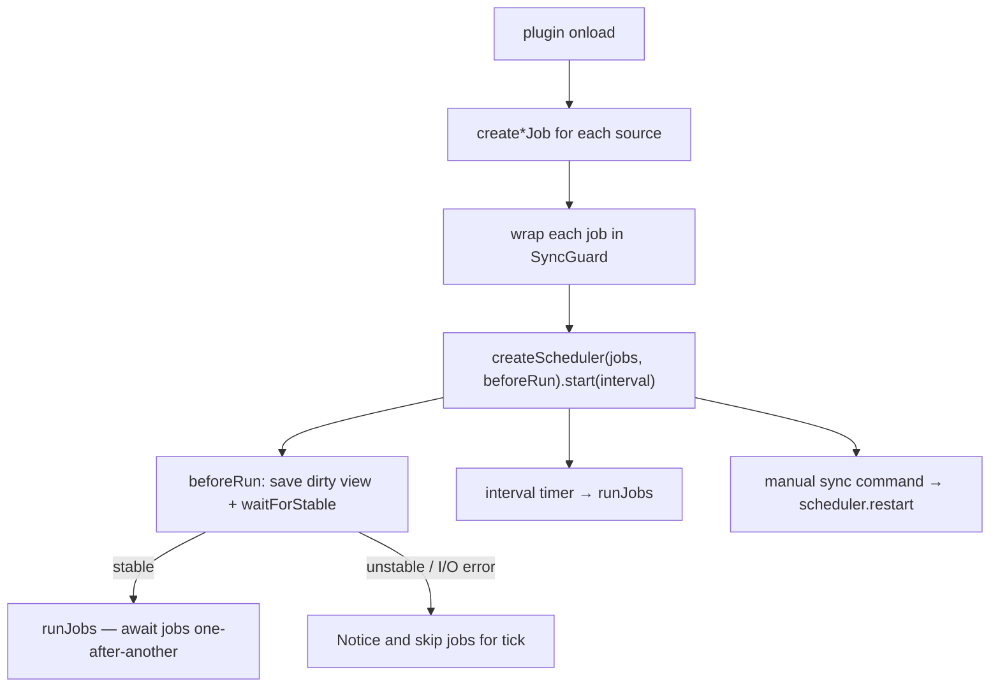
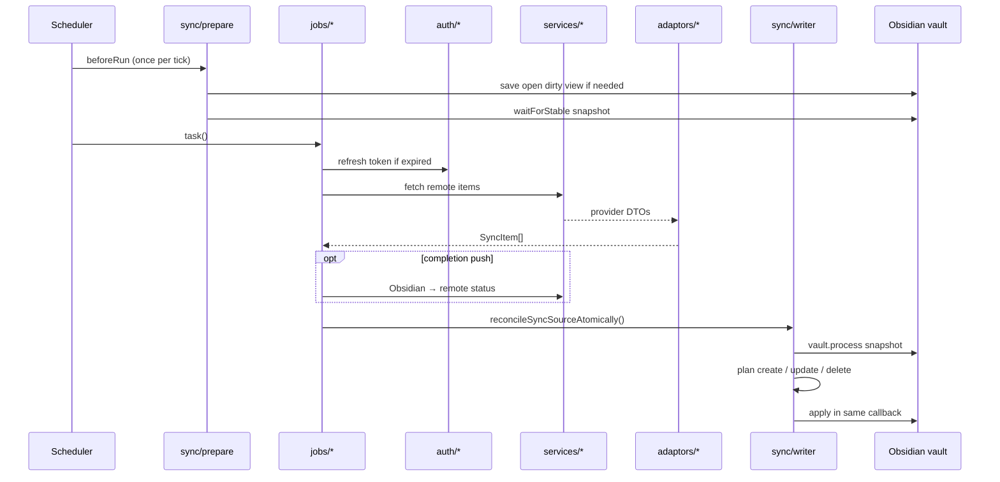

# Architecture

Obsidian plugin that pulls external items into a target Markdown note under a configurable H2 heading.

Path alias: `@/*` → `src/*`. Bundle: `esbuild.config.mjs` → `src/plugin/index.ts` → `main.js`.

Hard constraints: no provider HTTP in `sync/`; no Obsidian APIs in `services/` or `adaptors/`; jobs write only via `reconcileSyncSourceAtomically` ([`src/sync/writer.ts`](../../src/sync/writer.ts)).

## Layers (`src/`)

| Layer       | Owns                                           |
| ----------- | ---------------------------------------------- |
| `plugin/`   | Lifecycle, settings UI, vault delete-detection |
| `sync/`     | Scheduler, prepare, reader/writer, sync-guard  |
| `jobs/`     | Per-source orchestration                       |
| `services/` | Provider HTTP + Firefox SQLite                 |
| `adaptors/` | DTO → `SyncItem`                               |
| `auth/`     | OAuth connect + refresh                        |
| `utils/`    | Pure helpers                                   |

Entry points: `plugin/{index,save-sync-document}.ts`, `sync/{scheduler,prepare-sync-document,writer,reader,sync-guard}.ts`, `jobs/*`, `services/*`, `adaptors/*`, `auth/{google,microsoft,azure-devops}.ts`.

## Module map

## Sync bootstrap

Jobs run sequentially: each `vault.process`es the same note; parallel runs race and drop creates. Prepare runs once per tick (shared `syncDocument`) before any job.

## One job cycle

Side path (Google Tasks only): vault `modify` in `plugin/index.ts` may delete remote tasks when lines disappear (`enableDeleteSync`). Other sources have no vault→remote delete path today.

## Core types

- `SyncItem` / `SyncAction` / `SyncSource` — [`src/sync/types.ts`](../../src/sync/types.ts)
- `SyncJob` / `SyncJobCreator` — [`src/jobs/types.ts`](../../src/jobs/types.ts)
- Sources: `"google-tasks"`, `"gmail-starred"`, `"microsoft-to-do"`, `"microsoft-outlook"`, `"azure-devops"`, `"firefox-bookmarks"`
